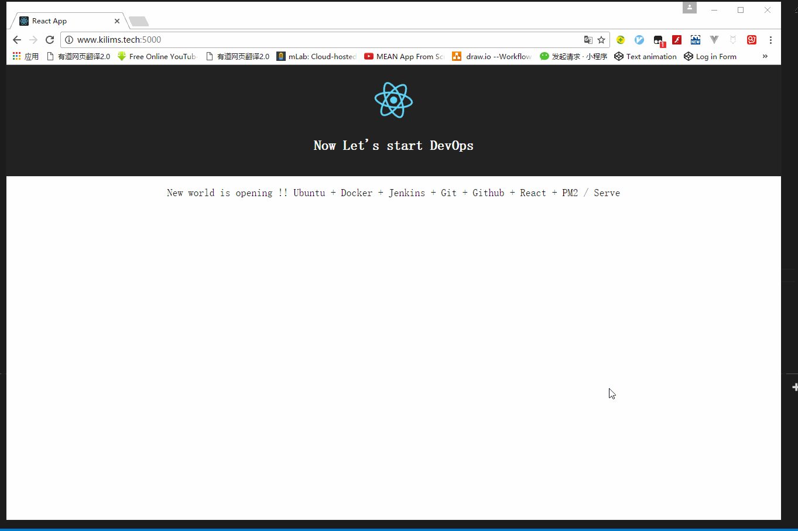

#  DevOps初尝-自动化部署APP

#### 效果

>  在本地用 `git push` 上远程github仓库的时候，自动把代码build一次且部署到相应的服务器上
>  查看App部署效果：http://www.kilims.tech:5000/

Steps:
1. 本地修改代码
2. Push到github
3. 泡杯java
4. 服务器自动部署完成

#### 实现技术栈

Cloud  | OS | Continuous Tools | SCM | App|
-------|----|------------------|-----|----|
||**+** |**+** |**+** |

#### 好处
 - 多人异地，同时对产品不同阶段进行开发
 - 自由办公的基础
 - 不同阶段的服务器同时部署，持续交付，简化部署流程

#### 环境准备

##### 服务器环境
 + Aliyun服务器
 + 域名+域名解析
 + Xshell+Xftp
 + Docker
    + Jenkins
 + Git
 + node
    + create-reat-app
    + PM2 / serve

> 在阿里云的环境下，大部分的设置是已经预设好了，但是仍然有坑，不用担心包和速度的问题。但是一些软件问题还是存在，比如docker+Jenkins+deploy这个流程

##### 本机/VMware

> 整体环境与服务器一样，但是要解决各种包慢，乃至慢到无法下载的问题，比如:
> + npm下载包慢
> + docker拉取镜像慢
> + Jenkins安装plugin慢及无法pull各种插件等问题
> + git pull/ push等问题

当然，以上工具的基本使用还是要知道的

***

 - [ ] 阿里云服务器调戏历程
 - [ ] 本地电脑Linux调戏历程 -- 虚拟机篇
 - [ ] 本地电脑Linux调戏历程 -- 真机装机篇
 - [ ] 科学上网的办法--自撘梯子
 - [ ] docker+Jenkins调戏历程(不搭梯子)
 - [ ] node/npm/git调戏历程(不搭梯子)
 - [ ] 自动化部署调戏历程
