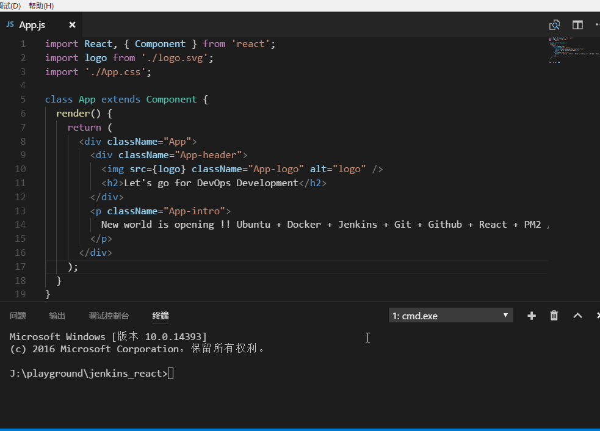

#  DevOps初尝-自动化部署APP

#### 效果

>  在本地用 `git push` 上远程github仓库的时候，自动把代码build一次且部署到相应的服务器上

#### 实现技术栈

Cloud  | OS | Continuous Tools | SCM | App|
-------|----|------------------|-----|----|
||**+** |**+** |**+** |

#### 好处

- 团队开发
  - 在github上设置branch，如(开发阶段，测试阶段，产品阶段)，然后根据开发流程逐一merge
  - 多人各地，随时随地办公的基础
  
- 分发
  - Jenkins可以target到不同的代码仓库，也可以target到一个代码仓库里面的不同branch，这就意味着，不同的branch可以同时部署到不同的服务器，也可以根据开发流程部署
